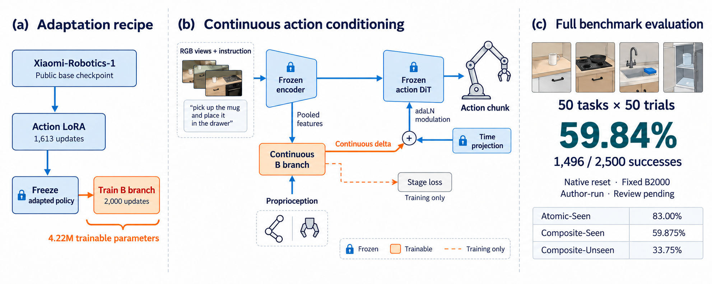

# OriginX：RoboCasa365 全量本地评测达到 59.84%

*2026 年 10 月 9 日｜技术报告与待审核结果*

*方法示意图：图中厨房画面为示意，并非真实 rollout 截图。59.84% 为作者本地评测结果，仍待主办方审核。*

我们完成了 OriginX 在 RoboCasa365 多任务协议下的 2,500 回合本地评测：50 个任务、每任务 50 回合，成功 1,496 次，Overall 为 **59.84%**。这是基于 Xiaomi-Robotics-1-RoboCasa365 的独立研究扩展。本文报告训练方法、评测结果及其证据边界；当前状态为**已提交审核，尚未接受**。

这一数值高于截至本次核查时公开榜单显示的最高分 58.1%。但跨来源分数比较不等于同条件配对实验，也不意味着我们已经获得官方第一。模型、代码和评测实现仍需主办方审核。尤其需要保留另一项结果：在此前独立的 600 对确认实验中，新模型只比原始模型多成功 6 次，未达到预设的可靠提升标准。

**从冻结教师到连续动作条件分支**

A2000 仅为历史 A1613 的公开发布别名；权重不变，实际训练仍为 1,613 次更新。

我们的出发点是保留原始策略的动作生成能力，研究一个较小的可训练分支能否提供有用的条件信息。完整模型继承链为：原始 Xiaomi-Robotics-1-RoboCasa365 → A2000 Action LoRA → B2000 连续条件分支。文章中的模型规模、训练量和成绩都应沿着这条继承链理解，不能归为从零训练的结果。

A2000 使用 rank 16、alpha 16 的 Action LoRA，累计处理 80,000 个窗口，完成 1,613 次更新。过程中曾改变训练批量，因此最终 batch 128 不能用于倒算整个阶段的历史样本数。B2000 随后冻结完整 A2000，包括已经训练的 LoRA，把它同时作为基础策略与教师。

B 新增 4,216,839 个可训练参数。分支根据观测特征与机器人状态生成连续表示，用来改变原生动作生成器的条件信息；阶段分类提供辅助监督。它的贡献进入实际动作计算，不只是预测一个评测时用不到的附加标签。输出投影的权重与偏置置零，使初始化时新增调制量为零。推理接口不接受真实阶段标签。

训练结合动作监督、教师保持约束和阶段辅助损失。教师项使用匹配的输入、噪声与时间步，约束模型预测的速度与冻结教师一致，权重为 1.0；阶段辅助项权重为 0.05。阶段标注不可靠时，仅屏蔽对应辅助损失，保留动作监督。该设计试图兼顾新条件信息与原有能力，但是否真正实现这一目标，必须由对照和消融实验判断。

这些实现细节已核对交付源码：`continuous_model_v3/branch.py` 定义零初始化与辅助损失掩码，`observed.py` 拼接观测特征和机器人状态，`bridge.py` 使用同一组动作输入、噪声和时间参数计算学生与冻结教师预测。动作损失掩码独立于阶段置信度。

**数据与已完成训练**

B2000 的固定终点为 2,000 次更新，global batch 为 128，总计 256,000 个窗口样本。完成收据记录耗时 8,453.98 秒，约 2.35 小时。这里的窗口数包含重复采样，不能当作独立轨迹数；这一训练在本轮全量评测前已经完成。

样本一半来自 Human300 replay，一半来自小规模 pilot。Pilot 包含 16 个任务、200 条现有轨迹，其中 168 条用于训练、32 条用于留出诊断，使用已有标注字段。本阶段没有新增人工标注或视觉语言模型标注，也没有使用 MimicGen 训练数据。Pilot 留出诊断不能替代独立任务泛化测试。

我们逐行核查了 A 的 80,000 行与 B 的 256,000 行固定采样计划：全部记录为 human 来源，覆盖 Human300 的 300 个任务，与正式 Composite-Unseen 的 16 个任务没有交集。Pilot 的 16 个任务均属于 Composite-Seen。这个结论覆盖本项目绑定的训练清单，不代表我们重新审计过 Xiaomi 原始模型的全部预训练数据。

**50 个任务、完整时限、原生重置**

正式任务集合包含 Atomic-Seen 18 项、Composite-Seen 16 项、Composite-Unseen 16 项，每项执行 50 回合。评测使用 pretrain 场景，并保留 RoboCasa 1.0.1 对各任务规定的 horizon。Overall 是 50 个任务成功率的平均值；由于每任务回合数相同，也等于总成功数除以 2,500。[官方多任务评测说明](https://robocasa.ai/docs/build/html/benchmarking/multitask_learning.html)

旧运行存在 reset patch 的协议疑问，因此本轮重新采用原生重置流程。执行期间固定 B2000 权重、任务、种子和时限，不依据观察到的成功率替换任务或选择检查点。最终审计逐一验证 2,500 份结果哈希、读回保护记录及原生 reset 前后证明，并确认原种子保持不变。

全部回合结束，基础设施未知结果为 0，未执行回合为 0。1,004 个策略失败回合均达到各自冻结的完整 horizon，没有通过提前终止困难任务缩短分母。这里的“完整”表示这份固定评测清单完整执行，并不等于主办方已经认证全部实现。

| 评测分组 | 任务数 | 成功／回合数 | 成功率 |
|---|---:|---:|---:|
| Atomic-Seen | 18 | 747／900 | 83.00% |
| Composite-Seen | 16 | 479／800 | 59.875% |
| Composite-Unseen | 16 | 270／800 | 33.75% |
| Overall | 50 | 1,496／2,500 | **59.84%** |

**与公开榜单的数值比较**

我们核查的[官方榜单](https://robocasa.ai/leaderboard.html)页面标注更新于 2026 年 10 月 8 日。当时 Paimon-0 的 Overall 显示为 58.1%，Xiaomi-Robotics-1 显示为 57.4%。下表保留公开分数原有精度；OriginX 为本地测得结果，尚未获得官方接受。

| 模型与结果来源 | Overall | Atomic-Seen | Composite-Seen | Composite-Unseen |
|---|---:|---:|---:|---:|
| Paimon-0，公开榜单 | 58.1% | 79.3% | 55.8% | 36.7% |
| Xiaomi-Robotics-1，公开榜单 | 57.4% | 80.2% | 57.1% | 32.1% |
| OriginX，本地待审核 | **59.84%** | 83.00% | 59.875% | 33.75% |

本地 Overall 比当时公开榜首显示值高 1.74 个百分点，同时 Composite-Unseen 仍低于 Paimon-0。这是对已报告数值的比较，不能直接解释为模型间的显著差异，也不能据此宣称所有能力领先。本轮没有同时执行原始基模在匹配条件下的 2,500 回合，因此无法把分数差额归因于新分支。

**必须同时报告的配对负结果**

此前，我们在另一组本地 30 个任务上先做每模型 150 回合开发评测，原始模型为 72%，B2000 为 76%。随后使用每任务 20 个新 seeds，对原始模型与冻结 B 各执行 600 回合，并检查初始场景配对一致性。原始模型成功 413 次，B 成功 419 次，分别为 68.83% 和 69.83%。

在 600 对结果中，B 赢 53 对、输 47 对、平 500 对。提升的 95% 区间为 [-2.17, 4.17] 个百分点，McNemar 检验 p=0.6173。预设的至少提升 5 个百分点、区间下界大于零两项标准均未达到。这个结果不证明两者等效，但明确不支持可靠提升的结论。全量本地高分没有消除这一不确定性，也不能替代同条件对照与方法消融。

**当前模型发布与加载**

完整模型资产发布于 [Hugging Face：Qinzhen3/OriginX](https://huggingface.co/Qinzhen3/OriginX)，包括原始基座的 3 个 safetensors 分片（合计 10,106,433,336 字节）、分词器与配置资产，以及 `adapter-originx-2000.pt` 和 `branch-00002000.pt` 两份适配权重；整个快照约 10.15 GB。实现代码仅通过 [OriginX GitHub 仓库](https://github.com/Quinn-Ma/OriginX)分发，包括 3 份固定版本的原始模型 Python 文件。仓库中的 `prepare_originx.py` 会组合两处资产，校验完整原始基座身份与两份适配权重哈希。A2000 仍是同一权重的发布别名，当前打包不改变历史训练和评测记录；原始逐回合证据保留在 GitHub 的版本化评测发布中。资产准备不代表完成 GPU 动作一致性验证或重新运行全量评测。

**Astra 实际介入：复测 B2000 的 1,004 个失败案例**

原评测结束后，我们只对 B2000 的 1,004 个历史失败案例做救援，覆盖 49 个任务。每个案例各有未干预 control 和 Astra 辅助两臂，因此 2,008 是回合尝试数，案例数始终为 1,004。全部尝试已经结束；原 1,496 个成功案例没有重测，原成绩仍为 1496/2500（59.84%）。

在原 horizon 一半之后的第一个常规 16 步策略查询点，辅助臂把当时的三个 RGB 视角、原任务指令和剩余步数交给 `gpt-6-astra high`。Astra 返回一次有界子目标，包装器追加 `Immediate next actions: <subgoal>` 与 `Then complete the original task.`，然后由冻结的 B2000 继续生成动作。没有训练、环境重置、观测历史清空或动作时限延长；隐藏物理状态、成功谓词、未来图像均不作为 Astra 输入。控制臂匹配动作步数；Astra 的额外计算与等待时间单独报告。

| 最终分类 | B2000 唯一失败案例 |
|---|---:|
| 严格确认救回 | **56** |
| 未救回 | 813 |
| 未知 | 28 |
| 初始状态偏差 | 107 |
| 固定总数 | **1,004** |

严格救回必须同时满足 control 失败、辅助臂成功、两臂初态与历史指纹完全匹配、干预前动作轨迹前缀完全匹配，以及真实 Astra 调用与已应用响应的关联证据。固定分母确认救回比例为 **56/1004=5.58%**；未知和初态偏差仍留在分母，因此这是确认救回的下界统计。匹配且完成的配对 **M=874**，其中实际应用 Astra 且凭证有效的配对 **E=869**，条件比例分别为 R/M=6.41%、R/E=6.44%。M 比 E 多出的 5 对仍为未知。M 中辅助独赢 56、control 独赢 0、双成功 0、双失败 818。由于只选择历史失败，本实验无法衡量原成功案例上的退化，也不估计整体基准提升。

| 原失败分组 | 固定案例 | 救回 | 未救回 | 未知 | 初态偏差 | 救回 / 固定案例 |
|---|---:|---:|---:|---:|---:|---:|
| Atomic-Seen | 153 | 12 | 125 | 0 | 16 | 7.84% |
| Composite-Seen | 321 | 25 | 218 | 8 | 70 | 7.79% |
| Composite-Unseen | 530 | 19 | 470 | 20 | 21 | 3.58% |

一个可核验实例是 `native-B-0525-PrepareCoffee-2090900525`：在 1,800 步时限的第 912 步，Astra 给出将杯口对准出水口、查看并操作前部控制的子目标；实际策略查询记录与已应用指令匹配。两臂历史初态和干预前前缀一致，辅助臂成功而对照失败。这不能单独证明究竟是哪一个动作造成成功。

v1 已开始的 36 个案例永久保留首次结果（救回 0、未救回 3、未知 28、初态偏差 5）；续跑只执行其余 968 个此前未开始的案例（56、810、0、102）。续跑只修复基础设施：在同一 socket 上只读 RNG 保活，避免等待期间连接超时；严格验证的原生初态偏差保留并允许继续派发。开始前通过 72 客户端一致性和 360 秒同 socket 保活验证。没有为匹配初态重采样，没有按结果择优重试。基础设施 pilot 的开发索引 48/97/249/345 单独报告为 0/4；这些开发 ID 仍披露在主队列中，pilot 成绩不加进主研究。

主研究按批次与 CLI receipt 去重后为 **135 次调用**，其中 134 次成功、1 次额度错误。已知计数为输入 2,592,713 tokens、输出 195,237 tokens，报告的 reasoning tokens 为 75,511；错误调用缺少计数，完整 token 总量仍未知。CLI 延迟合计 6,186.44 秒，中位数每调用 46.16 秒，范围 2.33–77.35 秒。这是 CLI 用时，不是整个复测耗时或每案例端到端等待；美元成本不可用。pilot 独立为 1 次调用，输入 19,071、输出 629、reasoning 137 tokens，耗时 24.35 秒。见[救援报告](ASTRA_RESCUE_REPORT.md)、[逐案例分类](evidence/astra-rescue/case-classification.json)和[去重用量](evidence/astra-rescue/cli-usage.json)。

此前的[三个失败案例离线分析](ASTRA_FAILURE_ANALYSIS.md)保留为历史诊断记录，其原因假设不能自动视为本轮已经证明。现有在线证据支持上述协议内的 56 个救回；不能把它们与旧成功相加，宣称新的 2,500 回合成绩或官方榜首。

**实现披露、提交边界与复核材料**

运行使用 CPU OSMesa 渲染，以及已有查询时刻像素保持验证的渲染降频、上下文生命周期管理和读回保护。它们属于需要随结果披露的实现细节，仍应接受独立复核。不能把使用官方任务集合自动等同于实现的每一部分都已获官方认可。

本轮从接手到收到完整结果约 3 小时 55 分钟，正式回合运行约 3 小时 13 分钟，既有训练耗时另行计算。我们没有在这段时间内重新训练模型。计划中的 C 候选需要继续训练 500 次更新、调整 replay/pilot 比例，但尚未执行；在可用 3 张空闲 GPU、现成配置要求 4 卡以及本轮预算约束下，优先完成冻结 B 的全量评测。

官方提交规则要求独立模型贡献、基模归因、可测量的改进以及可复现说明；短微调或 LoRA 本身不能自动成为新条目。我们的连续分支确实参与动作生成，但其增益与新颖性是否达到接收要求，仍由证据和主办方审核决定。[提交规则](https://github.com/robocasa-benchmark/leaderboard)

交付材料包括实验报告、机器可读汇总、逐回合证据包、执行源码及最终审计。审计记录固定配置和 manifest 的 SHA-256，并验证本地归档中的全部结果哈希与远端汇总一致。最终分支文件 SHA-256 为 `41988b92391953687b39a0bc5a35bce962fbfcd08fbf6e550108430850d9944f`。证据包不含模型权重或访问凭证，不能代替提交审核所需的模型访问。

这项工作已经取得一个可以复核的完整本地结果，也留下清楚的未解问题：新分支是否带来稳定增益、哪些设计有效，以及跨实现复测能否复现当前分数。我们已以 **59.84% 的本地待审核结果**提交审核，并同时保留配对确认的负结果；在审核完成前，不将其表述为已经登上官方榜首。
<!-- CONFIRMATORY_50_START -->
## 新seed补充实验：缩减后的50案例研究

用户要求三小时交付后，将已启动的2500案例计划缩减为每任务1例：按原清单固定选择各任务最小新环境seed，共**50个不同案例、350个分臂结果**。选择未读取结果，但发生在启动后，不能称为全新预注册。B2000比较C/R/G/L/V，原始Xiaomi比较C/V；C为原指令对照，R重复原指令，G追加固定通用指令，L为纯文本Astra建议，V为带图像Astra建议。模型、原生reset、seed、horizon与Astra High均固定。

终态有效分臂记录**350/350**，认领**350/350**。原批次中范围外的191条记录单列保留。未知、缺失与不匹配比较均保留在50例分母。

| Comparison | Fixed cases | Matched | Rescues | Regressions | Unresolved | Full-cohort net-effect bounds (pp) |
|---|---:|---:|---:|---:|---:|---|
| B/G_vs_C | 50 | 44 | 1 | 1 | 6 | [-12.0, 0.0] |
| B/L_vs_C | 50 | 45 | 0 | 1 | 5 | [-12.0, -2.0] |
| B/R_vs_C | 50 | 47 | 0 | 1 | 3 | [-8.0, -2.0] |
| B/V_vs_C | 50 | 44 | 1 | 0 | 6 | [-8.0, 4.0] |
| B/V_vs_L | 50 | 42 | 2 | 0 | 8 | [-6.0, 16.0] |
| base/V_vs_C | 50 | 47 | 0 | 1 | 3 | [-6.0, 0.0] |

**这组实验未证明净提升。** B模型C与V均为29/50成功（58%），R为28/50，G与L各27/50。这些是分臂描述性结果，不能直接作配对因果结论。V对C有44组匹配、1次救回、0次退化，另6组初态不匹配，完整50例的净效应界限为**−8至+4个百分点**。所有比较的技术未知与前缀不匹配计数均为0；表中未解决项均为初态不匹配。

44组匹配B V/C中，18组在触发前结束、18组实际应用视觉建议、8组回退原指令。B的全部V臂分别为20次真实建议交付、10次回退、20次提前结束。V/L匹配42组中有2个V独有成功，但其中1个V实际回退原指令且C也成功，不能归为视觉推理救回；另1个才实际使用视觉建议。原始Xiaomi的C为26/50成功、V为25/50；47组匹配中救回0、退化1。

表中上下界包含未解决比较，是识别界限而非置信区间。rescues表示参考臂失败而处理臂成功，regressions表示反向变化；均须通过配对验证。V_vs_L的参考臂是L，其余是C。本次350个分臂全部结束；配对差异来自初态不匹配，且部分建议未交付而回退原指令。小样本和不完整建议覆盖不能支持普遍提升或视觉推理优势。

**实际应用案例：WashFruitColander。** 第1584步收到的已保存视觉建议是操作出水口右侧的水龙头控制、保持滤篮在水流下，并检查芒果、桃和苹果是否都在篮内。V臂实际应用该建议后在2347步成功；同初态、同干预前轨迹的C与L臂均到3150步仍失败。这里证实了建议确实应用且随后成功，不能进一步断言“补果”或某个单独动作就是成功原因。

运行期间，broker将一次已恢复的CLI重连事件误判为终态错误。原始错误、事件、计量、结果和停派记录完整保留；独立基础设施续跑只处理从未认领工作，不替换已认领结果、不重复生成已执行CLI。恢复校验要求成功终态、结构合法、身份一致且无工具调用。

实际计量：72次唯一CLI；已知输入1,244,218、输出24,566token；完整输入输出计量为True。输出已含推理token，不重复累加。CLI执行时间合计871.88秒（不是单案例等待时间）。计入所有主实验批次、范围外工作及失败调用，开发使用另列：B/base的6次调用为102,367输入、1,011输出token（执行时间合计56.25秒），GR00T准入的1次调用为17,203输入、213输出token（10.85秒）；这7次与主实验72次调用不重合。美元成本未知。无新训练、额度重置或付费。

本次交付**未运行GR00T正式跨架构评测**，开发准入不能当效果证据。历史1496/2500与56/1004保持不变；本补充研究不产生新的榜单分数，也不能保证论文录用。

### Future directions / 后续研究

以更大新seed样本同时估计救回与退化，将带图像建议和重复指令、通用指令、纯文本建议配对比较；完整保留未知。独立GR00T实验检验架构迁移。提前冻结干预时机和停滞检测器，补齐算力匹配对照、等待延迟与真机验证。当前证据不代替这些尚未完成的实验。

终态报告SHA-256：`d437095e785fd603cb6e99a2ae0d9556dbc2254a212ebef138e4a07c592c8270`。完整机器可读证据见[evidence/confirmatory-50/report.json](evidence/confirmatory-50/report.json)。
